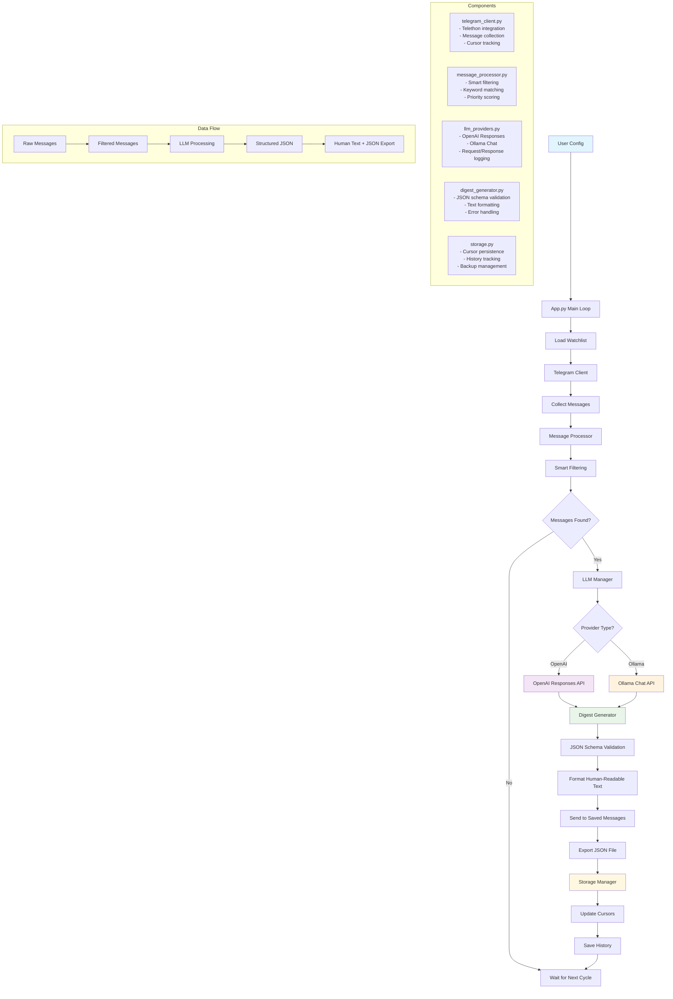

# Telegram Digest Bot

A powerful Telegram bot that monitors your selected channels and chats, filters important messages, and generates AI-powered digests using OpenAI's Responses API or local Ollama models. Perfect for staying informed about important discussions across multiple Telegram channels without getting overwhelmed by the constant stream of messages.

## Architecture Flow



## Features

- **Smart Message Filtering**: Identifies mentions, financial amounts, dates, deadlines, and keywords
- **AI-Powered Summarization**: Uses OpenAI Responses API or local Ollama for intelligent digest generation
- **Structured Output**: Generates JSON with urgent items, decisions, topics, calendar events, and more
- **Incremental Processing**: Tracks message cursors to avoid duplicate processing
- **Customizable**: Configurable prompts, filters, and watchlists
- **Privacy-Focused**: Optional sensitive data redaction for cloud LLMs
- **Persistent Storage**: Maintains history and state across runs
- **Flexible Scheduling**: Run continuously or on-demand
- **Configurable Logging**: Easy control over log levels and output destinations
- **Multi-Provider Support**: Seamlessly switch between OpenAI and local Ollama models
- **Comprehensive Watchlists**: Monitor both public channels and private chats

## Quick Setup

### 1. Install Dependencies

```bash
python3 -m venv .venv
source .venv/bin/activate  # On Windows: .venv\Scripts\activate
pip install -r requirements.txt
```

### 2. Get Telegram API Credentials

1. Go to https://my.telegram.org/apps
2. Create a new application
3. Note your `api_id` and `api_hash`

### 3. Configure the Bot

Edit `config.yaml`:
```yaml
telegram:
  api_id: YOUR_API_ID
  api_hash: YOUR_API_HASH

llm:
  provider: "ollama"  # or "openai"
  ollama:
    base_url: "http://localhost:11434"
    model: "mistral:latest"
    temperature: 0.1
    top_p: 0.9

logging:
  level: "INFO"  # Options: DEBUG, INFO, WARNING, ERROR, CRITICAL
  file_logging: true
  console_logging: true
```

Edit `watchlist.yml` to specify which chats/channels to monitor:
```yaml
watchlist:
  channels:
    - name: "@your_channel"
      enabled: true
      keywords: ["urgent", "deadline", "meeting"]
      max_messages: 50
      priority: high
  chats:
    - name: "Work Group"
      chat_id: -1001234567890
      enabled: true
      keywords: ["project", "deadline", "budget"]
      max_messages: 30
      priority: high
```

### 4. Run the Bot

```bash
# Run once
python app.py --once

# Run continuously (every 4 hours by default)
python app.py

# Show storage statistics
python app.py --stats

# Reset message cursors
python app.py --reset-cursors
```

## Configuration

### Main Config (`config.yaml`)

- **telegram**: API credentials and session settings
- **llm**: Choose between OpenAI or Ollama, configure models and parameters
- **digest**: Processing intervals, message limits, and filtering options
- **output**: Delivery settings (Saved Messages, JSON export)
- **storage**: Data persistence and backup settings
- **security**: Sensitive data redaction for cloud LLMs
- **logging**: Configurable log levels, file/console output, and formats

### Watchlist (`watchlist.yml`)

Define which chats and channels to monitor:
- **channels**: Public channels using `@username` (e.g., @kleros, @proofhumanity)
- **chats**: Private chats and groups using chat_id (e.g., -1001234567890)
- **keywords**: Custom keywords per chat for targeted filtering
- **global_keywords**: Keywords applied to all monitored chats
- **priority**: Set processing priority (high, medium, low) for each chat
- **max_messages**: Limit messages collected per chat per cycle

### System Prompt (`prompts/digest_system.txt`)

Customize how the AI analyzes your messages. The default prompt focuses on:
- Urgent items requiring attention
- Decisions made or pending
- Important topics with summaries
- People updates
- Calendar events and deadlines
- Unanswered mentions

## LLM Provider Setup

### OpenAI Responses API

```yaml
llm:
  provider: "openai"
  openai:
    api_key: YOUR_API_KEY  # or set OPENAI_API_KEY env var
    model: "gpt-4.1"
    max_tokens: 2000
    temperature: 0.3
```

### Local Ollama

1. Install Ollama: https://ollama.ai
2. Start Ollama service: `ollama serve`
3. Pull a model: `ollama pull mistral:latest` (or llama3.2, codellama, etc.)
4. Configure:

```yaml
llm:
  provider: "ollama"
  ollama:
    base_url: "http://localhost:11434"
    model: "mistral:latest"  # Use the model you pulled
    temperature: 0.1
    top_p: 0.9
```

**Benefits of Ollama:**
- **Privacy**: All processing happens locally
- **Cost**: No API costs or rate limits
- **Offline**: Works without internet connection
- **Customizable**: Use different models and fine-tune parameters

## Usage Examples

### Continuous Mode
```bash
# Run every 4 hours (default)
python app.py

# Custom interval in config.yaml
digest:
  interval_minutes: 120  # Every 2 hours
```

### One-Time Run
```bash
python app.py --once
```

### Monitoring and Maintenance
```bash
# View statistics
python app.py --stats

# Reset all cursors (reprocess all messages)
python app.py --reset-cursors

# Reset specific chat cursors
python app.py --reset-cursors "@channel1" "-1001234567890"
```

## Output Format

The bot generates two types of output:

### 1. Human-Readable Digest (sent to Saved Messages)
```
📊 Message Digest - 2024-01-15 14:30
========================================

🚨 URGENT ITEMS
• Server issues reported in #alerts channel
• Contract review needed by Friday

💬 REQUIRES YOUR RESPONSE
• @alice asked about the budget approval

📅 CALENDAR & DEADLINES
• Team standup - 2024-01-16 at 09:00
• Project deadline - 2024-01-20
```

### 2. Structured JSON Data
```json
{
  "urgent": ["Server issues in production"],
  "decisions": ["Budget approved for Q1"],
  "topics": [
    {
      "topic": "Server Migration",
      "summary": "Discussion about moving to new infrastructure",
      "participants": ["Alice", "Bob", "Carol"]
    }
  ],
  "people_updates": [
    {
      "person": "Alice",
      "update": "Started new project, will be less available"
    }
  ],
  "calendar": [
    {
      "event": "Team standup",
      "date": "2024-01-16",
      "time": "09:00"
    }
  ],
  "unanswered_mentions": [
    "@you can you review the proposal?"
  ]
}
```

## Security & Privacy

- **Session File**: Your Telegram session is stored in `data/user_session.session` - keep this secure
- **API Keys**: Store in environment variables or secure config files
- **Data Redaction**: Enable `redact_sensitive` to remove emails, phone numbers, etc. before sending to cloud LLMs
- **Chat Denylist**: Specify sensitive chats to never process in `security.sensitive_chat_denylist`

## Troubleshooting

### Common Issues

1. **Authentication Error**: Make sure `api_id` and `api_hash` are correct
2. **LLM Connection Failed**: 
   - **OpenAI**: Check API keys and model availability
   - **Ollama**: Ensure `ollama serve` is running and model is pulled
3. **No Messages Found**: Verify chat IDs and permissions
4. **Permission Denied**: Ensure the bot can read from specified chats
5. **Ollama Validation Error**: Check if Ollama is accessible at `http://localhost:11434`
6. **Private Chat Access**: Ensure you're a member of private chats you want to monitor

### Logs

Check `digest_bot.log` for detailed error messages and debugging information.

### Storage Issues

```bash
# Check storage statistics
python app.py --stats

# Reset cursors if stuck
python app.py --reset-cursors

# Manual backup
cp -r data/ backup_$(date +%Y%m%d)/
```

## Advanced Usage

### Custom Filtering

Modify `watchlist.yml` to customize filtering:

```yaml
global_keywords:
  - "urgent"
  - "deadline" 
  - "@your_username"
  - "Kleros"
  - "Curate"
  - "Entries"

financial_keywords:
  - "$"
  - "budget"
  - "invoice"
  - "USD"
  - "BTC"
  - "price"

temporal_keywords:
  - "today"
  - "tomorrow"
  - "meeting"
  - "deadline"
  - "due"
  - "schedule"
```

### Logging Configuration

Easily control logging verbosity without code changes:

```yaml
logging:
  level: "INFO"        # DEBUG, INFO, WARNING, ERROR, CRITICAL
  file_logging: true   # Log to digest_bot.log
  console_logging: true # Log to terminal
  format: "%(asctime)s - %(name)s - %(levelname)s - %(message)s"
```

**Log Levels:**
- **DEBUG**: Very verbose, all internal operations
- **INFO**: Important events and progress (recommended)
- **WARNING**: Only warnings and errors
- **ERROR**: Only errors
- **CRITICAL**: Only critical errors

### System Prompt Customization

Edit `prompts/digest_system.txt` to change how the AI analyzes messages. You can:
- Add industry-specific terminology (e.g., blockchain, Kleros, arbitration)
- Adjust focus areas (technical vs business)
- Modify output format and structure
- Add context about your role or priorities
- Customize JSON schema for different use cases

**Default Structure:**
- **Urgent Items**: Immediate attention required
- **Decisions**: Important decisions made or pending
- **Topics**: Key discussions with summaries and participants
- **People Updates**: Significant updates about team members
- **Calendar**: Events, deadlines, and scheduled items
- **Unanswered Mentions**: Direct questions requiring response

### Deployment

For production deployment:

1. **Systemd Service** (Linux):
```bash
sudo cp telegram-digest-bot.service /etc/systemd/system/
sudo systemctl enable telegram-digest-bot
sudo systemctl start telegram-digest-bot
```

2. **Docker** (create Dockerfile):
```dockerfile
FROM python:3.11-slim
WORKDIR /app
COPY . .
RUN pip install -r requirements.txt
CMD ["python", "app.py"]
```

3. **Environment Variables**:
```bash
export TELEGRAM_API_ID=your_api_id
export TELEGRAM_API_HASH=your_api_hash
export OPENAI_API_KEY=your_openai_key
export OLLAMA_BASE_URL=http://localhost:11434
export OLLAMA_MODEL=mistral:latest
```

## Testing

The project includes comprehensive tests with detailed request/response logging for debugging.

### Running Tests

```bash
# Install test dependencies
pip install -r requirements.txt

# Run all tests
python run_tests.py all

# Run only unit tests
python run_tests.py unit

# Run integration tests
python run_tests.py integration

# Run tests with coverage report
python run_tests.py coverage

# Run fast tests (exclude slow integration tests)
python run_tests.py fast

# Or use pytest directly
pytest -v
pytest -m "not integration"  # Unit tests only
pytest --cov=src --cov-report=html  # With coverage
```

### Test Structure

- `tests/test_message_processor.py` - Message filtering and processing logic
- `tests/test_llm_providers.py` - OpenAI and Ollama API integration
- `tests/test_digest_generator.py` - Digest generation and JSON validation
- `tests/test_storage.py` - Data persistence and cursor management
- `tests/test_integration.py` - Full pipeline integration tests

### Logging and Debugging

All LLM requests and responses are logged with unique request IDs for debugging:

**OpenAI:**
```
[openai_1705123456] Sending request to OpenAI model gpt-4.1
[openai_1705123456] Request input length: 1250 characters  
[openai_1705123456] OpenAI response received in 2.34 seconds
[openai_1705123456] Response content: {"urgent": [...], "decisions": [...]}
[openai_1705123456] Successfully parsed OpenAI response as JSON
```

**Ollama:**
```
[ollama_1705123456] Sending request to Ollama model mistral:latest
[ollama_1705123456] Request URL: http://localhost:11434/api/chat
[ollama_1705123456] Ollama response received in 53.65 seconds
[ollama_1705123456] Model evaluation time: 29.61 seconds
[ollama_1705123456] Successfully parsed Ollama response as JSON
```

Check `digest_bot.log` for detailed error information and API debugging. Use the configurable logging system to control verbosity levels.

### Mocking for Tests

Tests use comprehensive mocking:
- `mock_openai_client` - Mock OpenAI Responses API
- `mock_httpx_client` - Mock Ollama HTTP client  
- `mock_telethon_client` - Mock Telegram client
- `temp_data_dir` - Isolated temporary storage

## Recent Updates & Features

### Latest Improvements (v2.0+)
- **Ollama Integration**: Full support for local LLM models with automatic JSON parsing
- **Configurable Logging**: Easy control over log levels without code changes
- **Enhanced Watchlists**: Support for both public channels and private chats with priority levels
- **Improved Digest Formatting**: Better organization with emojis and clear section headers
- **Multi-Provider Architecture**: Seamless switching between OpenAI and Ollama
- **Enhanced Error Handling**: Better validation and fallback mechanisms

### Example Watchlist Configuration
```yaml
watchlist:
  channels:
    - name: "@kleros"
      enabled: true
      keywords: ["Kleros", "arbitration", "dispute", "resolution"]
      max_messages: 50
      priority: high
    
    - name: "@proofhumanity"
      enabled: true
      keywords: ["Proof of Humanity", "PoH", "identity"]
      max_messages: 50
      priority: medium
  
  chats:
    - name: "Private Kleros Channel"
      chat_id: -1001234567890
      enabled: true
      keywords: ["internal", "announcement", "update"]
      max_messages: 50
      priority: high
```

## Contributing

1. Fork the repository
2. Create a feature branch
3. Make your changes
4. Add tests for new functionality
5. Ensure all tests pass: `python run_tests.py all`
6. Check test coverage: `python run_tests.py coverage`
7. Submit a pull request

## License

MIT License - see LICENSE file for details.

## Support

For issues and questions:
1. Check the troubleshooting section
2. Review logs in `digest_bot.log`
3. Open an issue on GitHub with configuration details (redact sensitive information)